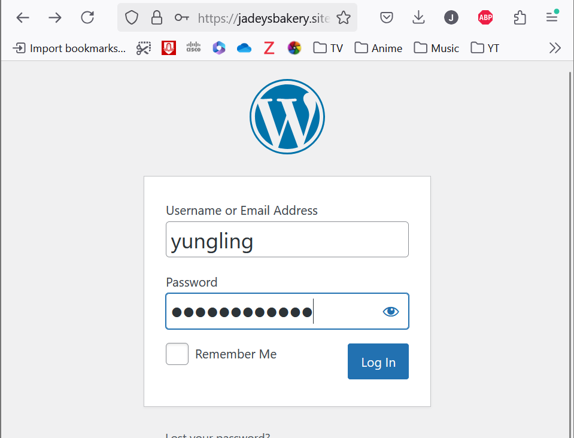
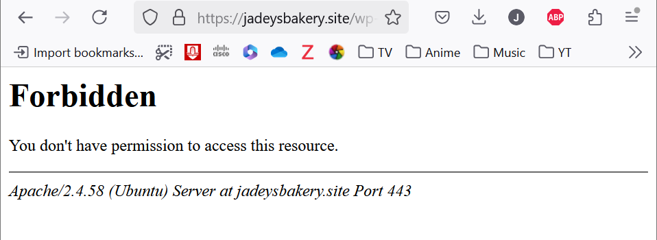

# Jadey's Bakery Project Proposal 🥖

**Student ID:** 35505126  
**IP Address:** 52.220.28.88  
**Website link** https://jadeysbakery.site/  
**© 2025 Jadey's Bakery**   
**Licensed under [CC BY-NC-SA 4.0](https://creativecommons.org/licenses/by-nc-sa/4.0/)**  
**Video:** https://youtu.be/Rk_KWg52zLw?si=fpY8yBMjav9x9mA

**Project Overview:**
The aim of the project is to create a IaaS that enables multifaceted usage within the sphere of baking to a wide variety of stakeholders. Jadey’s Bakery is the home of sourdoughs for the soul, secret recipes, and organic ingredients. Whether you’re an Individual chasing the next flavour hit, a business looking to purchase/supply ingredients, or a hobbyist with untold recipes, Jadey's bakery kneads all realms of baked goodness in one place. Partnerships with local businesses to purchase baking equipment and quality produce is advanced through an online SaaS that connects suppliers, and customers through an interactive open platform. Customers can leave feedback on ingredients, share ideas, post photos, comment, rate, and review recipes. Inventory tracker software boosts efficiency by streamlining orders on products, saving the need for manual ordering or forgetful minds. Implementation of algorithms that tailor to specific health needs make selecting specific recipes, ingredients, or products faster and easier. The online website will provide fast delivery options, as well as a local pickup storefront that online orders can be collected from. This will maximise efficiency for stakeholders as well as giving a chance to interact in person with the bakery storefront, something that is missing in a purely digital online store. Connectivity through baking is the central theme of Jadey’s Bakery, providing an interactive baking website, as such a monthly leaderboard for the best sourdough will be posted and shared. This will promote sharing of ideas and inspire competition, with the grand reward of publicity, as a business or individual. A membership program will also be provided where local businesses will receive a discount on monthly orders, while individuals receive discount coupons on individual orders.

## Jadey’s Bakery – Project Timeline

**Week 1 (May 10–17):**
- Created initial static HTML layout
- Planned site features
- Started GitHub tracking

**Week 2 (May 17–24):**
- Switched to WordPress for scalability
- Installed Astra theme
- Set up basic pages and navigation

**Week 3 (May 24–31):**
- Integrated AWS SES with .php scripts
- Set up SSL with Let’s Encrypt
- Started inventory tracking PHP script
- Started timer for sourdough baking tracking

**Week 4 (June 1–7):**
- Finalized theme and styling
- Fixed HTTPS redirection
- Configured domain + cleaned WordPress

**Scripting components and explanation:**   
Sourdough clock: Automatic timer to remind users of when to attend to their dough.
Most adapted from this source code: https://github.com/siamcomm/simple-countdown-timer/blob/master/script.js  
https://github.com/sanjudhritlahre/JS-CountDown-Timer  
https://javascript.info/settimeout-setinterval  
https://www.geeksforgeeks.org/java-script-settimeout-setinterval-method/  
https://github.com/diogoko/multitimer/blob/master/multitimer.html  

Contact form: Option to contact the business.

VPN: 
- Secure remote administration to prevent attackers from attackers scanning from public ports.
- Keeps admin tools and login pages hidden from the internet.
- I can run test versions and debug only accessible via the VPN.
- Here are the screenshots of my VPN setup process:

  


https://github.com/OpenVPN/openvpn/blob/master/sample/sample-config-files/server.conf

Additional notes:
Most of my work was done in test branch so that is where you will see proof for working on the project over a month. A lot of trial, error and changes has been implemented but this main branch backs up all my final work.

# 1. Launch EC2 instance in AWS
- Launch an instance in Asia Pacific (Singapore).
- Allocate a name, Amazon Machine Image (Ubuntu), instance type (t2.micro), generate a key pair and add a security group that allows SSH (22), HTTP (80), HTTPS(443), OpenVPN (1194)

# 2. Register a Domain Name with GoDaddy
- Purchase Domain Name Jadey's Bakery with GoDaddy.
- Go to DNS Management and add A record

# 3. Go to Route 53
- Create a hosted zone with domain name.
- Switch to wizard- simple routing. Record type- A, value/ route traffic to- IP address, TTL- 300 seconds.
- Define another simple record- start domain name with www, record type- CNAME and put in your domain name to value/route traffic to box, TTL- 300 seconds.
- Copy NS type- value/route traffic to four links to GoDaddy.

# 4. Go back to GoDaddy
- Go to Domain.
- Go to manage DNS.
- Go to name servers.
- Add 4 name servers.
- When copying, exclude the '.'.
- Wait 4-6 hours. 🙃

# 5. Connect to EC2
- Go to EC2 dashboard and click connect.
- Go into SSH client and follow the instructions under that tab.
- Type the command ```sudo apt update && sudo apt upgrade``` into CLI.
- Type the command ```sudo apt install ssh apache2``` into CLI.
- Type the command ```ip addr``` and copy ip address into Elatic IP page in AWS.

# 6. Set up static IP
- Go to Elastic IP.
- Allocate Elastic IP address and associate it with EC2 instance.

# 7. UFW
- Type the command ```sudo ufw allow ssh``` into CLI. This allows incoming SSH connections.
- Type the command ```sudo ufw allow http``` into CLI. This allows web traffic.
- Type the command ```sudo ufw allow https``` into CLI. This allows secure web traffic.
- Type the command ```sudo ufw enable``` into CLI. Enables firewall.
- Verify the command ```sudo ufw status verbose```.

# 8. Install SSL with Certbot
- Type the command ```sudo snap install core``` into CLI. This allows installs snap.
- Type the command ```sudo snap refresh core``` into CLI. 
- Type the command ```sudo snap install --classic certbot``` into CLI. This installs in classic mode.
- Type the command ```sudo certbot --apache``` into CLI. This automatically obtains and installs an SSL certificate for the apache server.
- Type the command ```sudo certbot renew --dry-run``` into CLI. This simulate the automatic renewal process to verify it works.

# 9. Download MySQL & wordpress on Ubuntu EC2 🥸
- Type the command ```sudo apt update```.
- Type the command ```sudo apt install mysql-server -y```.
- Type the command ```sudo mysql_secure_installation```.
- Type the command ```sudo apt install php libapache2-mod-php php-mysql``` to install php.
- Make sure you set up a strong root password, remove anonymous users, disallow remote root login, remove test database and reload priviledge tables.
- Log in to sql with the command ```sudo mysql```.
- Type these commands replacing the password.
- Type the command ```CREATE DATABASE wordpress;```
- Type the command ```CREATE USER 'wpuser'@'localhost' IDENTIFIED BY 'Password';```
- Type the command ```GRANT ALL PRIVILEGES ON wordpress.* TO 'wpuser'@'localhost';```
- Type the command ```FLUSH PRIVILEGES;```
- Type the command ```EXIT;```
- Type the command ```cd /tmp``` then ```wget https://wordpress.org/latest.tar.gz```
- Unzip the file ```tar -xvzf latest.tar.gz```
- ```sudo cp -a wordpress/. /var/www/html/``` move the wordpress folder into apache root file.
 
# 11. Wordpress 🥸
- Choose a template and start establishing your website's homepage.

# 12. Open VPN install
- Type the command ```sudo apt update```
- Type the command ```wget https://openvpn.net/downloads/openvpn-as-latest-ubuntu20.amd_64.deb```
- Type the command ```sudo dpkg -i openvpn-as-latest-ubuntu20.amd_64.deb```
- Type the command ```sudo apt install -f```
- Type the command ```sudo apt install openvpn easy-rsa -y```
- Type the command ```make-cadir ~/openvpn-ca```. This sets up the Public Key Infrastructure.
- Type the command ```cd ~/openvpn-ca```
- Type the command ```./easyrsa init-pki``` 
- Type the command ```./easyrsa build-ca```This build the certificate authority. Enter your password of choice and a username.
- Type the command ```./easyrsa gen-req server nopass``` This build the server certificate.
- Type the command ```./easyrsa sign-req server server``` This signs it. Confirm it with yes.
- Type the command ```./easyrsa gen-dh```
- Type the command ```openvpn --genkey secret ta.key```
- Type the command ```sudo cp pki/ca.crt pki/issued/server.crt pki/private/server.key pki/dh.pem ta.key /etc/openvpn/```
- Type the command ```sudo gunzip -c /usr/share/doc/openvpn/examples/sample-config-files/server.conf.gz | sudo tee /etc/openvpn/server.conf```
- Type the command ```sudo nano /etc/openvpn/server.conf```
-```conf
ca ca.crt
cert server.crt
key server.key
dh dh.pem
tls-auth ta.key 0
cipher AES-256-CBC
auth SHA256
user nobody
group nogroup
keepalive 10 120
persist-key
persist-tun
status openvpn-status.log
verb 3
- Type the command ```sudo nano /etc/sysctl.conf```
- Uncomment or add this line: net.ipv4.ip_forward=1
- Type the command ```sudo sysctl -p```
- Type the command ```sudo systemctl start openvpn@server```
- Type the command ```sudo systemctl status openvpn@server```

To generate a user: 
- Type the command ```cd ~/openvpn-ca```
- Type the command ```./easyrsa gen-req yungling nopass```
- Type the command ```./easyrsa sign-req client yungling```
- Type the command ```sudo ufw allow 1194/udp```
- Type the command ```sudo ufw reload```

Download .ovpn file to desktop.
Install Open VPN on your laptop.
Upload your file to OVPN.
Source: https://github.com/OpenVPN/openvpn/blob/master/sample/sample-config-files/server.conf

- Type the command ```cd /var/www/html/wp-admin/```
- Type the command ```sudo nano .htaccess```
- Add this inside the folder.
```
<Files wp-login.php>
        <RequireAll>
                Require ip 10.8.0.0/24
                Require all denied
        </RequireAll>
</Files>
```  

# 13. WP Recipe Maker
- Install a plugin on wordpress page called WP Recipe Maker.
- Activate plugin.
- Choose the wordpress editor for the plugin.
- Go to pages.
- Add a page and name it "Recipes".
- Click the + on the top left.
- Drag and drop "WPRM Recipe" and "Recipe snippet" to the page

# 14. WP User Frontend
- Install WP User Frontend plugin.
- Create your first form: Submit Recipe Form
- Edit the form and add recipe title, upload picture, ingredients list, instructions and ratings.

# 15. Link Amazon SES
- Enter your email address for the website.
- Fill in your domain name and follow through with the set up process.
- Verify your email address.
- Add DKIM records to Route 53.

# 16. Set up contact us form and link to SES.
Followed: https://github.com/PHPMailer/PHPMailer  https://docs.aws.amazon.com/ses/latest/dg/send-email-smtp.html
- On EC2 instance:
- Type the command ```cd /var/www/html```
- Type the command ```sudo mkdir -p phpmailer```
- Type the command ```cd phpmailer```
- Type the command ```sudo wget https://github.com/PHPMailer/PHPMailer/archive/refs/heads/master.zip```
- Type the command ```sudo apt install unzip -y```
- Type the command ```sudo unzip master.zip```
- Type the command ```mv PHPMailer-master/* .```
- Type the command ```rm -rf PHPMailer-master master.zip```
- Type the command ```sudo nano /var/www/html/send_mail.php```

- Go to AWS SES Console.
- Go to SMTP Settings.
- Click "Create SMTP Credentials"
- Download the username and password.
- Put it in send_mail.php file

# Backing up wordpress and other scripting files.
- Type the command ```sudo apt update```
- Type the command ```sudo apt install zip -y```
- Type the command ```cd /var/www/html```
- Type the command ```crontab -e```
- Select '1'
- Type this in and change **YourPassword**.  ```30 2 * * * mysqldump -u root -p**YourPassword** wordpress | tee /home/ubuntu/wordpress-db-$(date +\%F).sql > /dev/null && tar -czf /home/ubuntu/wordpress-files-$(date +\%F).tar.gz -C /var/www html```

References:
cp6. (n.d.). PHP PDO MySQL Cheat Sheet. https://github.com/cp6/PHP-PDO-MySQL-cheat-sheet

Dhritlahre, S. (n.d.). JS-CountDown-Timer. https://github.com/sanjudhritlahre/JS-CountDown-Timer

diogoko. (n.d.). multitimer/multitimer.html. https://github.com/diogoko/multitimer/blob/master/multitimer.html

GeeksforGeeks. (2023). JavaScript setTimeout() & setInterval() methods. https://www.geeksforgeeks.org/java-script-settimeout-setinterval-method/

JavaScript.info. (n.d.). setTimeout and setInterval. https://javascript.info/settimeout-setinterval

OpenVPN. (n.d.). server.conf (Sample config file). https://github.com/OpenVPN/openvpn/blob/master/sample/sample-config-files/server.conf

siamcomm. (n.d.). simple-countdown-timer. https://github.com/siamcomm/simple-countdown-timer/blob/master/script.js
